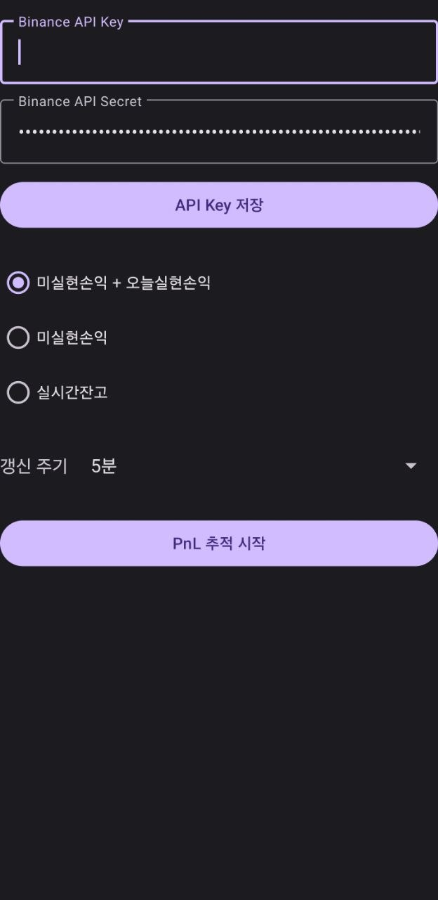
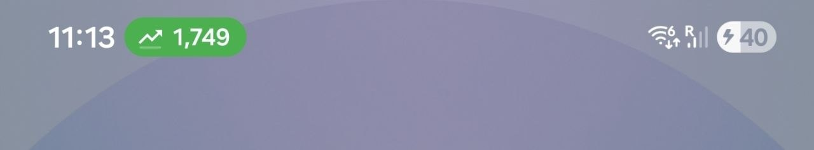
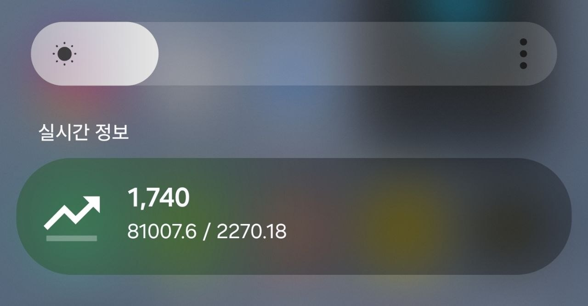
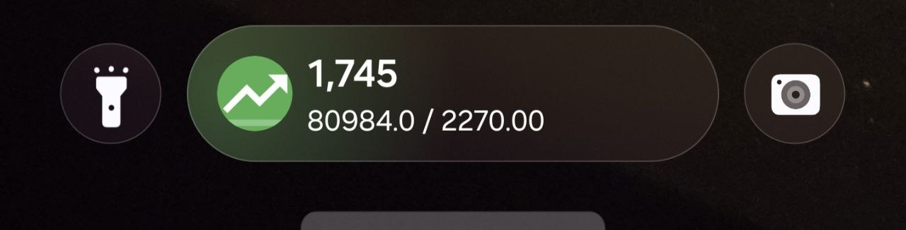

# binance position app

주기적으로 미실현손익을 조회해서 상단바 및 삼성 Now bar에 표시해주는 앱

## 스크린샷

| 앱 설정 화면 | 상단바 표시 | Now Bar (확장) | Now Bar (잠금화면) |
|:---:|:---:|:---:|:---:|
|  |  |  |  |

## 기능

- Binance API를 통한 선물 포지션 미실현손익(PnL) 실시간 조회
- 표시 모드 선택: 미실현손익 + 오늘실현손익 / 미실현손익 / 실시간잔고
- 상단 상태바에 PnL 표시
- 삼성 Now Bar에 PnL 및 잔고 정보 표시
- 갱신 주기 설정 가능

## 주의사항

- API KEY는 읽기전용으로 생성하세요.
- Now bar는 삼성에서 허용된 앱만 사용가능하여, 이를 우회하기 위해 카카오택시 앱과 동일한 패키지명을 사용하였습니다. 카카오택시 앱을 이용중이라면 스포티파이 등 다른 Now bar를 지원하는 앱의 패키지명으로 변경하면 정상작동합니다.
